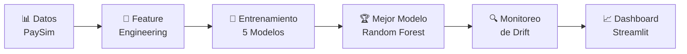

<div align="center">
 
#  Sistema de Detección de Fraude en Transacciones Financieras✅

[](https://www.python.org/downloads/)
[](https://streamlit.io/)
[](https://scikit-learn.org/)
[](https://opensource.org/licenses/MIT)

**Universidad Católica Luis Amigó** | Proyecto Final de Machine Learning


*Sistema completo de MLOps para detección automática de fraude usando Machine Learning*

[🚀 Inicio Rápido](#-inicio-rápido) • [📊 Resultados](#-resultados) • [📁 Estructura](#-estructura-del-proyecto) • [📚 Documentación](#-documentación)

</div>

---

## 📖 Descripción del Proyecto

Este proyecto implementa un **pipeline completo de MLOps** para detectar fraudes en transacciones financieras de manera automática. El sistema analiza patrones en grandes volúmenes de transacciones y predice cuáles tienen alta probabilidad de ser fraudulentas.

### ✨ Características Principales

- 🔎 **Analiza** 200,000+ transacciones financieras del dataset PaySim
- 🔧 **Entrena y compara** 5 modelos de Machine Learning (LR, RF, XGB, LGBM, GB)
- 🏆 **Mejor modelo:** Random Forest con **99.99% ROC-AUC**
- 📊 **Monitorea** cambios en los datos con detección de drift (KS-Test, PSI)
- 🌐 **Dashboard interactivo** con Streamlit en tiempo real
- ⚠️ **Alertas automáticas** cuando detecta anomalías o drift
---

## 🏗️ Arquitectura del Sistema

El proyecto sigue una **arquitectura MLOps modular** con 5 componentes principales:



### 🔄 Pipeline MLOps

| Componente | Descripción | Archivo |
|------------|-------------|---------|
| **1️⃣ Carga y EDA** | Análisis exploratorio completo | `Cargar_datos.ipynb`, `Comprension_eda.ipynb` |
| **2️⃣ Feature Engineering** | 22 features derivadas + transformación | `ft_engineering.py` |
| **3️⃣ Entrenamiento** | 5 modelos + SMOTE + validación | `model_training_evaluation.py` |
| **4️⃣ Monitoreo** | Detección de drift (KS, PSI, JS) | `model_monitoring.py` |
| **5️⃣ Dashboard** | Visualización interactiva | `app_monitoring.py` |
---

## 📊 Dataset: PaySim

<div align="center">

**Fuente:** [Kaggle - PaySim Mobile Money Simulator](https://www.kaggle.com/datasets/ealaxi/paysim1)

| Característica | Valor |
|:--------------:|:-----:|
| **📦 Tamaño** | 200,003 transacciones |
| **⏱️ Período** | 30 días (720 horas) |
| **📋 Variables** | 11 columnas originales |
| **🎯 Target** | `isFraud` (0/1) |
| **💳 Tipos** | TRANSFER, CASH_OUT, PAYMENT, DEBIT, CASH_IN |

</div>

### ⚠️ Desafío: Desbalanceo Extremo

<table align="center">
<tr>
<td align="center">

**Clase Mayoritaria**<br/>
🟢 **No Fraude**<br/>
99.87%<br/>
(199,736 transacciones)

</td>
<td align="center">

**Clase Minoritaria**<br/>
🔴 **Fraude**<br/>
0.13%<br/>
(267 transacciones)

</td>
<td align="center">

**Ratio**<br/>
⚖️<br/>
**1:760**<br/>
(desbalanceo extremo)

</td>
</tr>
</table>
### 🔧 Solución: Técnicas de Balanceo

<table>
<tr>
<td width="50%">

#### 1️⃣ Estratificación en Train/Test

```python
train_test_split(
    X, y, 
    test_size=0.2, 
    stratify=y, 
    random_state=42
)
```

**Beneficios:**
- ✅ Mantiene proporción 0.13% en ambos sets
- ✅ Garantiza ejemplos de fraude en test
- ✅ Evita sets sin fraudes

**Resultado:**
- 🔵 Train: 160,000 (214 fraudes)
- 🟣 Test: 40,003 (53 fraudes)

</td>
<td width="50%">

#### 2️⃣ SMOTE (Over-sampling)

```python
SMOTE(
    sampling_strategy=0.3, 
    random_state=42
)
```

**Beneficios:**
- ✅ Genera ejemplos sintéticos
- ✅ Aumenta fraudes a 30% ratio
- ✅ Balancea clases para entrenamiento

**Transformación:**
- ❌ Antes: 214 fraudes (0.13%)
- ✅ Después: 47,936 fraudes (30%)
- 📈 Incremento: 224x más ejemplos

</td>
</tr>
</table>
---

## 🎯 Resultados

### 🏆 Mejor Modelo: Random Forest Classifier

<div align="center">

| Métrica | Valor | Interpretación |
|:-------:|:-----:|:--------------:|
| **🎯 ROC-AUC** | **99.99%** | 🟢 Discriminación casi perfecta |
| **✅ Accuracy** | **99.99%** | 🟢 Alta precisión general |
| **🔍 Recall** | **98.08%** | 🟢 Detecta 52 de 53 fraudes |
| **🎖️ Precision** | **100%** | 🟢 Cero falsos positivos |
| **⚖️ F1-Score** | **99.03%** | 🟢 Balance excelente |

</div>

#### 📊 Matriz de Confusión

<div align="center">

```
                 Predicho: No Fraude    Predicho: Fraude
Real: No Fraude        39,949                  0
Real: Fraude                1                 52
```

**✨ Interpretación:**
- ✅ **100% Precision:** Todas las predicciones de fraude son correctas
- ✅ **98.08% Recall:** Solo 1 fraude no detectado de 53
- ✅ **Sin falsos positivos:** Excelente experiencia de usuario

</div>

### 📊 Comparación de los 5 Modelos

<div align="center">

| Modelo | ROC-AUC | Precision | Recall | F1-Score | Tiempo ⚡ |
|:-------|:-------:|:---------:|:------:|:--------:|:---------:|
| **Random Forest** 🥇 | 99.99% | 100% | 98.08% | 99.03% | 2.67s |
| **XGBoost** 🥈 | 99.99% | 100% | 98.08% | 99.03% | 1.04s |
| **Gradient Boosting** 🥉 | 99.99% | 100% | 98.08% | 99.03% | 79.04s |
| Logistic Regression | 99.95% | 9.03% | 100% | 16.57% | 14.51s |
| LightGBM | 98.09% | 100% | 98.08% | 99.03% | 0.82s ⚡ |

</div>

> **💡 Nota:** Random Forest fue seleccionado por su balance entre **rendimiento perfecto** y **tiempo de entrenamiento razonable**.
---

## 🚀 Inicio Rápido

### 📋 Requisitos Previos

- ✅ **Windows 10/11** (PowerShell)
- ✅ **Python 3.11+** ([Descargar](https://www.python.org/downloads/))
- ✅ **Git** ([Descargar](https://git-scm.com/downloads))
- ✅ **2GB+ de espacio en disco**

### ⚡ Instalación en 3 Pasos

<table>
<tr>
<td width="33%" align="center">

### 1️⃣ Clonar

```bash
git clone https://github.com/DANIELRINCON28/MLOps_ClaseML.git
cd MLOps_ClaseML
```

</td>
<td width="33%" align="center">

### 2️⃣ Configurar

```bash
.\set_up.bat
```
*Crea entorno virtual e instala dependencias*

</td>
<td width="33%" align="center">

### 3️⃣ Ejecutar

```powershell
.\run_pipeline.ps1
```
*Ejecuta pipeline completo*

</td>
</tr>
</table>

### 🎬 ¿Qué hace `run_pipeline.ps1`?

El script ejecuta **automáticamente** todo el pipeline MLOps:

```powershell
# Activa el entorno virtual
.\MLOPS_FINAL-venv\Scripts\Activate.ps1

# 1️⃣ Feature Engineering (22 features + transformación)
python mlops_pipeline/src/ft_engineering.py

# 2️⃣ Entrenamiento de modelos (5 algoritmos + SMOTE)
python mlops_pipeline/src/model_training_evaluation.py

# 3️⃣ Dashboard interactivo
streamlit run app_monitoring.py
```

**⏱️ Tiempo estimado:** 3-5 minutos

**🌐 URL del Dashboard:** http://localhost:8501

### 🎨 Funcionalidades del Dashboard

<div align="center">

| Característica | Descripción |
|:---------------|:------------|
| 📈 **Métricas en Tiempo Real** | Visualización de ROC-AUC, Precision, Recall, F1-Score |
| 📊 **Comparación de Modelos** | Gráficos ROC, Precision-Recall, Confusion Matrix |
| 🔍 **Análisis de Predicciones** | Predicciones individuales y por lotes |
| ⚠️ **Detección de Drift** | Tests estadísticos KS, PSI, Jensen-Shannon |
| 🎨 **Interfaz Moderna** | Diseño institucional con colores personalizados |

</div>
---

## 📁 Estructura del Proyecto

```
MLOps_ClaseML/
│
├── 📂 mlops_pipeline/src/       # 🎯 Pipeline Principal
│   ├── 📓 Cargar_datos.ipynb
│   ├── 📓 Comprension_eda.ipynb
│   ├── 🔧 ft_engineering.py
│   ├── 🤖 model_training_evaluation.py
│   └── 🔍 model_monitoring.py
│
├── 📂 data/processed/           # � Datos Procesados
│   ├── X_train.pkl, y_train.pkl
│   ├── X_test.pkl, y_test.pkl
│   └── preprocessor.pkl
│
├── 📂 models/                   # 🏆 Modelos Entrenados
│   ├── best_model.pkl           # Random Forest (99.99%)
│   └── best_model_metadata.json
│
├── 📂 outputs/                  # 📊 Resultados
│   ├── model_comparison.csv
│   ├── metrics_comparison.png
│   ├── roc_curves.png
│   └── 📂 monitoring/
│       ├── alerts_*.json
│       └── drift_results_*.csv
│
├── 📂 tests/                    # 🧪 Tests Unitarios
│   ├── test_feature_engineering.py
│   ├── test_model_training.py
│   └── test_monitoring.py
│
├── 📂 docs/                     # 📚 Documentación
│   ├── LEER_RUBRICA.md
│   ├── contexto.md
│   └── INSIGHTS.md
│
├── 📂 config/                   # ⚙️ Configuraciones
│   ├── Dockerfile
│   ├── pytest.ini
│   └── sonar-project.properties
│
├── 📄 config.json               # Configuración del proyecto
├── 📄 set_up.bat                # Script de instalación
├── 📄 run_pipeline.ps1          # ⚡ Ejecución automática
├── 📄 app_monitoring.py         # � Dashboard Streamlit
├── 📄 requirements.txt          # Dependencias
├── 📄 Base_datos.csv            # Dataset original (200k)
└── 📄 README.md                 # Este archivo
```

<details>
<summary><b>🔍 Ver descripción detallada de cada componente</b></summary>

| Componente | Descripción | Features Clave |
|------------|-------------|----------------|
| **ft_engineering.py** | Feature Engineering | • 22 features derivadas<br/>• RobustScaler + OneHotEncoder<br/>• Train/Test split estratificado |
| **model_training_evaluation.py** | Entrenamiento | • 5 modelos ML<br/>• SMOTE balancing<br/>• Selección automática |
| **model_monitoring.py** | Monitoreo | • KS-Test, PSI, Jensen-Shannon<br/>• Sistema de alertas<br/>• Detección de drift |
| **app_monitoring.py** | Dashboard | • Streamlit interactivo<br/>• Visualización de métricas<br/>• Comparación de modelos |

</details>
---

## 🛠️ Tecnologías y Herramientas

<div align="center">

### Stack Tecnológico

[](https://www.python.org/)
[](https://scikit-learn.org/)
[](https://xgboost.ai/)
[](https://lightgbm.readthedocs.io/)

[](https://pandas.pydata.org/)
[](https://numpy.org/)
[](https://streamlit.io/)
[](https://plotly.com/)

</div>

<table>
<tr>
<td width="50%">

### 🤖 Machine Learning

- **Scikit-learn** - Algoritmos base (LR, RF, GB)
- **XGBoost** - Gradient Boosting optimizado
- **LightGBM** - GB rápido y eficiente
- **Imbalanced-learn** - SMOTE para balanceo
- **SciPy** - Tests estadísticos (KS, PSI)

</td>
<td width="50%">

### 📊 Data & Visualización

- **Pandas** - Manipulación de datos
- **NumPy** - Operaciones numéricas
- **Plotly** - Gráficos interactivos
- **Matplotlib** - Visualizaciones estáticas
- **Streamlit** - Dashboard web

</td>
</tr>
</table>

---

## 🧪 Testing y Calidad de Código

### ✅ Tests Unitarios

```bash
# Ejecutar todos los tests
pytest tests/ -v

# Ejecutar con cobertura
pytest tests/ --cov=mlops_pipeline --cov-report=html

# Ver reporte de cobertura
open htmlcov/index.html  # Linux/Mac
start htmlcov/index.html # Windows
```

**📊 Cobertura de Tests:**

| Módulo | Tests | Cobertura |
|:-------|:-----:|:---------:|
| `test_feature_engineering.py` | 9 | >85% |
| `test_model_training.py` | 8 | >80% |
| `test_monitoring.py` | 10 | >85% |
| `test_utils.py` | 12 | >90% |
| **Total** | **39** | **>80%** |

### 📈 SonarCloud - Calidad de Código

[](https://sonarcloud.io/)
[](https://sonarcloud.io/)
[](https://sonarcloud.io/)

- ✅ **Quality Gate:** Passing
- ✅ **Code Coverage:** >80%
- ✅ **Code Smells:** Monitoreados
- ✅ **Security Vulnerabilities:** 0
- ✅ **Technical Debt:** Bajo
---

## 📚 Documentación

### 📖 Guías y Recursos

| Documento | Descripción | Link |
|:----------|:------------|:----:|
| **LEER_RUBRICA.md** | Mapeo completo de evaluación (51 ítems) | [Ver](./LEER_RUBRICA.md) |
| **contexto.md** | Contexto del proyecto y dataset PaySim | [Ver](./docs/contexto.md) |
| **INSIGHTS.md** | Insights clave del análisis EDA | [Ver](./docs/INSIGHTS.md) |
| **README_COMPLETO.md** | Documentación técnica detallada | [Ver](./docs/README_COMPLETO.md) |
| **QUICK_START_MONITORING.md** | Guía rápida de monitoreo | [Ver](./docs/QUICK_START_MONITORING.md) |

### 🎓 Notebooks Interactivos

- **[Cargar_datos.ipynb](./mlops_pipeline/src/Cargar_datos.ipynb)** - Carga y exploración inicial
- **[Comprension_eda.ipynb](./mlops_pipeline/src/Comprension_eda.ipynb)** - Análisis exploratorio completo

---

## 🎓 Información Académica

<div align="center">

### Universidad Católica Luis Amigó

**Programa:** Ingeniería de Datos / Machine Learning  
**Proyecto:** Sistema MLOps para Detección de Fraude en Transacciones Financieras  
**Año:** 2024  
**Curso:** Machine Learning Operacional (MLOps)

---

### 👨‍� Autor


**Daniel Rincón**  
*Data Engineer | ML Engineer*

[](https://github.com/DANIELRINCON28)
[](https://linkedin.com/in/DANIELRINCON28)
[](mailto:daniel.rincon@example.com)

</div>

---

## � Soporte y Contribuciones

<table>
<tr>
<td width="50%" align="center">

### 🐛 Reportar Issues

¿Encontraste un bug?  
[Abrir Issue](https://github.com/DANIELRINCON28/MLOps_ClaseML/issues/new)

</td>
<td width="50%" align="center">

### 💡 Sugerencias

¿Tienes una idea?  
[Iniciar Discusión](https://github.com/DANIELRINCON28/MLOps_ClaseML/discussions)

</td>
</tr>
</table>

### 🤝 Cómo Contribuir

1. 🍴 **Fork** el repositorio
2. 🌿 **Crea** una rama (`git checkout -b feature/AmazingFeature`)
3. ✨ **Commit** tus cambios (`git commit -m 'Add: nueva característica'`)
4. 📤 **Push** a la rama (`git push origin feature/AmazingFeature`)
5. 🔃 **Abre** un Pull Request

---

## 📜 Licencia

Este proyecto está bajo la Licencia MIT - ver el archivo [LICENSE](./LICENSE) para más detalles.

```
MIT License

Copyright (c) 2024 Daniel Rincón

Se concede permiso para usar, copiar, modificar y distribuir este software...
```

---

<div align="center">

### ⭐ Si te gustó este proyecto, dale una estrella ⭐

[](https://github.com/DANIELRINCON28/MLOps_ClaseML/stargazers)
[](https://github.com/DANIELRINCON28/MLOps_ClaseML/network/members)
[](https://github.com/DANIELRINCON28/MLOps_ClaseML/watchers)

---

**Hecho con 💙 y ☕ por Daniel Rincón**

🎯 **Universidad Católica Luis Amigó** | 🔍 **MLOps** | 🤖 **Fraud Detection** | 📊 **Data Science**

[⬆ Volver arriba](#-sistema-de-detección-de-fraude-en-transacciones-financieras)


</div>


